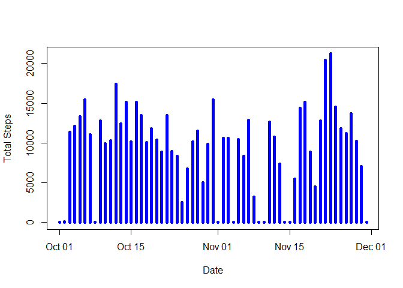
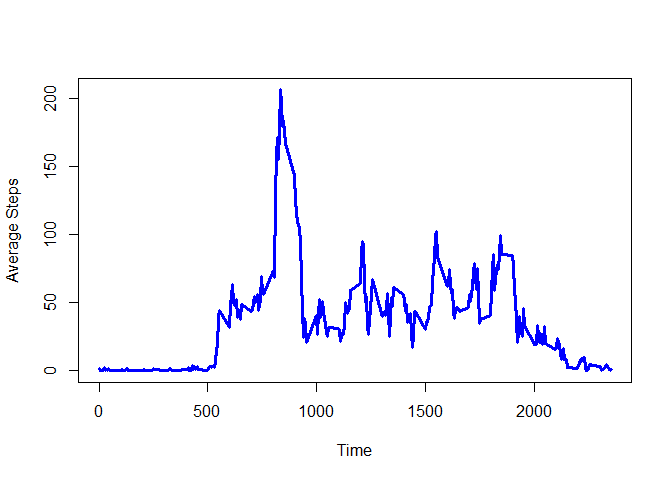
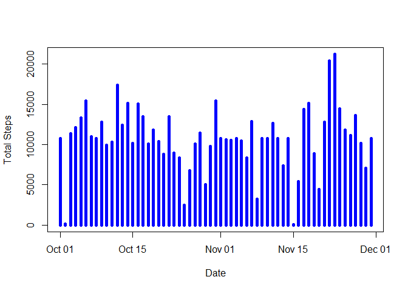
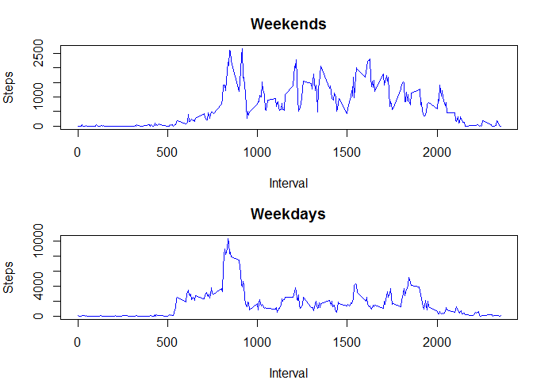

# Reproducible Research: Peer Assessment 1


## Loading and preprocessing the data


```r
library(ggplot2)
```

```
## Warning: package 'ggplot2' was built under R version 3.4.2
```

```r
data<-read.csv(unz("activity.zip", "activity.csv"),sep = ",")
data$date <- as.Date(data$date)
```

## What is mean total number of steps taken per day?
Histogram:

```r
Daily <- aggregate(data$steps, by = list(data$date), FUN = sum, na.rm = TRUE)
names(Daily)<- c("date", "total_steps")

plot(total_steps~date, Daily, type = "h", lwd = 5, xlab = "Date", ylab = "Total Steps", col = "blue")
```

<!-- -->

Mean Steps per day:

```r
mean(Daily$total_steps)
```

```
## [1] 9354.23
```

Median Steps per Day:

```r
median(Daily$total_steps)
```

```
## [1] 10395
```

## What is the average daily activity pattern?
Daily Pattern:

```r
Byint  <- aggregate(data$steps, by = list(data$interval), FUN = mean, na.rm = TRUE)
names(Byint)<- c("time", "steps")

plot(steps~time, Byint, type = "l", xlab = "Time", ylab = "Average Steps", lwd = 3, col = "blue")
```

<!-- -->

5 minute interval with Maximum number of steps:

```r
Byint[Byint$steps == max(Byint$steps),]
```

```
##     time    steps
## 104  835 206.1698
```

## Imputing missing values
Total Missing Values:

```r
sum(is.na(data))
```

```
## [1] 2304
```

Replace missing Values with Average for that time interval

```r
new<- data
new$steps <- ifelse(is.na(new$steps) == TRUE, Byint$steps[Byint$time %in% new$interval], new$steps) 
```


New Histogram

```r
Daily <- aggregate(new$steps, by = list(new$date), FUN = sum, na.rm = TRUE)
names(Daily)<- c("date", "total_steps")

plot(total_steps~date, Daily, type = "h", lwd = 5, xlab = "Date", ylab = "Total Steps", col = "blue")
```

<!-- -->

New Mean

```r
mean(Daily$total_steps)
```

```
## [1] 10766.19
```

New Median

```r
median(Daily$total_steps)
```

```
## [1] 10766.19
```

By imputing the missing data we have raised the mean slightly. The Median now matches the mean as there were previously no 2 days with exactly the same totals, However since there were 2 full days of missing data there are now 2 that have been filled with the mean data.

## Are there differences in activity patterns between weekdays and weekends?


```r
#Setup Factor variable for Weekdays and Weekends

new$day <- ifelse(weekdays(new$date) == "Sunday"|weekdays(new$date) == "Saturday","Weekend","Weekday")
SumDat <- aggregate(new$steps,by = list(new$interval, new$day), FUN = sum )
names(SumDat)<- c("Interval", "Day", "Steps")

#create panel plot with steps on weekdays and weekends at each interval
par(mfrow = c(2,1), mar = c(4,4,3,1))
plot(Steps~Interval, SumDat[SumDat$Day == "Weekend",],type = "l",col = "blue", main = "Weekends" )
plot(Steps~Interval, SumDat[SumDat$Day == "Weekday",],type = "l", col = "blue", main = "Weekdays", xlab = "Interval")
```

<!-- -->
